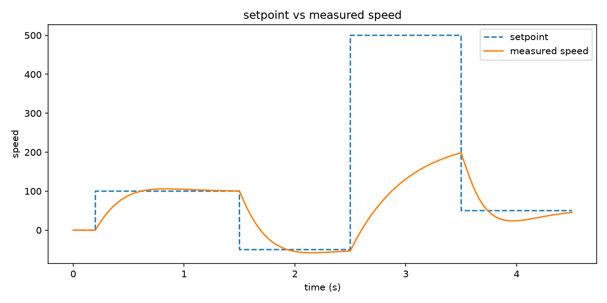
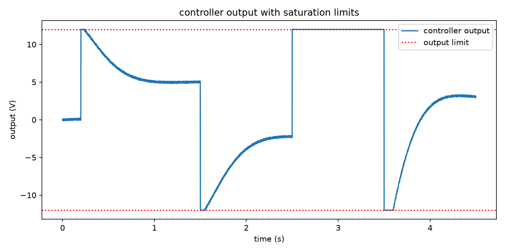

# pid-core

Most PID code I have written lived on a microcontroller, where it is hard to
test properly: you flash it, watch a motor spin, and hope. So I pulled the
controller itself out into a plain C99 library with no dependencies, and
wrote a small DC motor model to run it against on a laptop. The controller
can be unit tested in a normal CI pipeline, and the same source cross
compiles for a Cortex-M target with no changes.


## Building and testing

```
cmake -S . -B build
cmake --build build
ctest --test-dir build --output-on-failure
```

That builds the `pid` static library, vendors in Unity for the test binary,
and runs the unit tests under `tests/test_pid.c`.

## Running the simulator

```
cmake --build build
./build/motor_sim step_response.csv
```

`motor_sim` runs a closed loop simulation of a first order DC motor at a
fixed 1 ms step, following a setpoint that steps up, steps down, and then
asks for more speed than the motor can physically deliver, so the
saturation behaviour is visible in the output. It writes
`time,setpoint,speed,output` to the CSV file you give it. You can pass
`Kp`, `Ki`, `Kd` as extra arguments to retune from the command line, for
example `./build/motor_sim step_response.csv 0.2 0.5 0.002`.

To generate the plots:

```
python3 -m venv .venv
.venv/bin/pip install matplotlib
.venv/bin/python tools/plot_response.py step_response.csv --out-dir docs
```

## The plots



Speed tracks each step cleanly and settles without much overshoot. The
overshoot you can see coming out of the unreachable-speed period is the
motor spinning down from the top speed it maxed out at, not oscillation.



The output sits flat on the +/-12 V limit while the setpoint asks for more
than the motor can give, then comes off the limit smoothly once the
setpoint drops back into range. If the integrator had wound up during that
saturated stretch, you would see it overshoot hard and take a while to
recover; instead it comes off the limit in the same handful of steps as
the previous transitions.

## How the controller works

`pid_update` takes a setpoint and a measurement and returns a clamped
output, in whatever units you are working in. Three things about it are
worth knowing before you use it.

**Anti-windup.** If the integrator just kept accumulating error while the
output is sitting at a limit, it would grow far past what is actually
needed, and once the setpoint became reachable again the controller would
stay pinned at the limit until that oversized integrator wound back down.
`pid_update` estimates what the output would be before committing to the
integrator update, and skips the update if the output is already past a
limit and the error would push it further past that same limit. If the
error would pull the output back the other way, it keeps integrating as
normal. That is why the recovery in the output plot above is quick.

**Derivative on measurement.** The derivative term is computed from the
change in the measurement, not the change in the error. If you take the
derivative of the error, a step change in setpoint makes the error jump
instantly, and dividing that jump by a small sample time gives you a huge
spike in the output even though the plant has not moved at all. The
measurement, on the other hand, changes smoothly, so basing the derivative
on it gives you the same damping against disturbances without reacting to
setpoint changes.

**Derivative filter.** A raw derivative amplifies noise, since noise is
mostly fast, small changes, and differentiation is exactly the operation
that emphasises fast changes. The derivative is passed through a
first-order low-pass filter with a configurable time constant (`tau` in
`pid_init`) before the gain is applied, trading a bit of lag for a lot less
noise sensitivity.

Everything is written in C99 with no dynamic allocation, no `printf`, and
nothing beyond `float`/`double` arithmetic, so it should compile and link
for a bare-metal target without modification.

## Using it on real hardware

Call `pid_update` from a timer interrupt at a fixed rate that matches the
`sample_time` you passed to `pid_init`. Keep that rate consistent; the
derivative and integral terms both assume a constant `dt`. Watch your
stack usage inside the ISR, and remember there is no dynamic allocation
anywhere in the library, so nothing here will fragment your heap or fail
an allocation at a bad moment.

This is an illustration, not a driver:

```c
void TIM2_IRQHandler(void) {
    if (TIM2->SR & TIM_SR_UIF) {
        TIM2->SR &= ~TIM_SR_UIF;

        float measured_speed = read_encoder_speed();
        float output = pid_update(&speed_pid, setpoint_rpm, measured_speed);

        uint16_t duty = voltage_to_duty(output);
        TIM3->CCR1 = duty;
    }
}
```

## Size on a Cortex-M4

From the cross compile job in CI, building `src/pid.c` with
`arm-none-eabi-gcc -mcpu=cortex-m4 -mthumb -Os -ffreestanding`:

- flash (text + data): 374 bytes
- RAM (data + bss): 0 bytes

RAM use per controller instance is just the size of one `pid_controller_t`
struct on the stack or in static storage; the library itself holds no
global state.

## Related

This is the controller theory behind
[closed-loop-motor-control-m2m-pid](https://github.com/arfaali-naikar/closed-loop-motor-control-m2m-pid),
cleaned up, pulled out of the original project, and actually tested.

## Licence

MIT, see [LICENSE](LICENSE).
